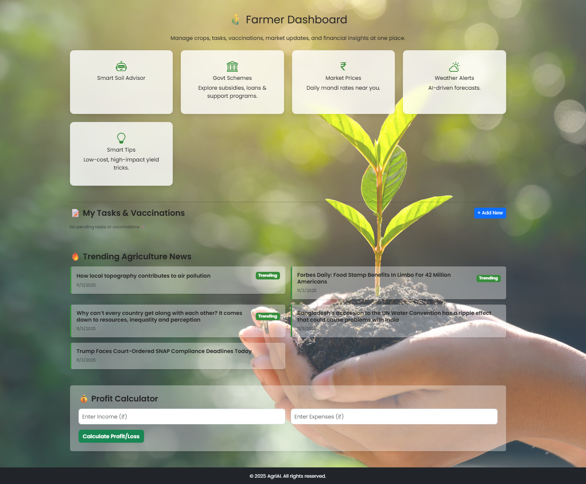
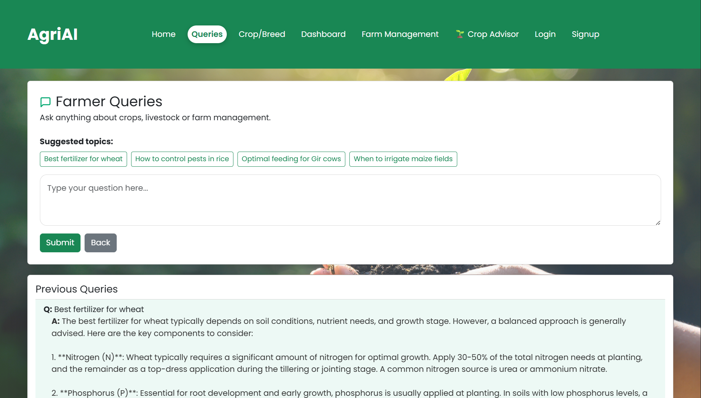
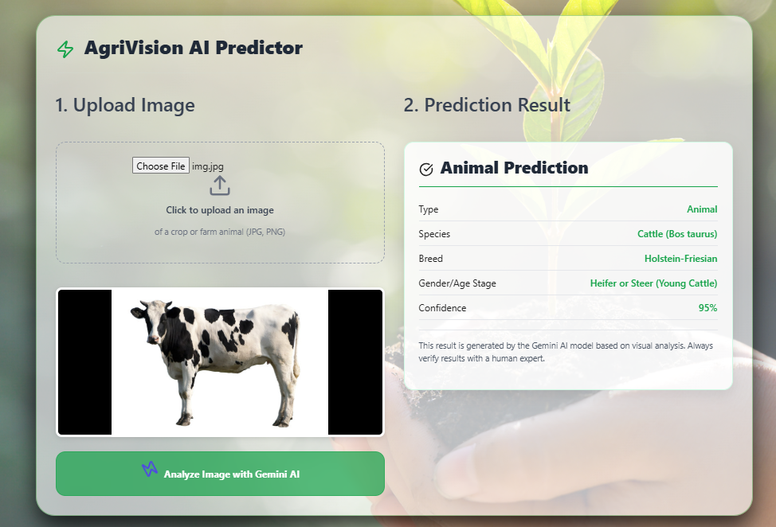
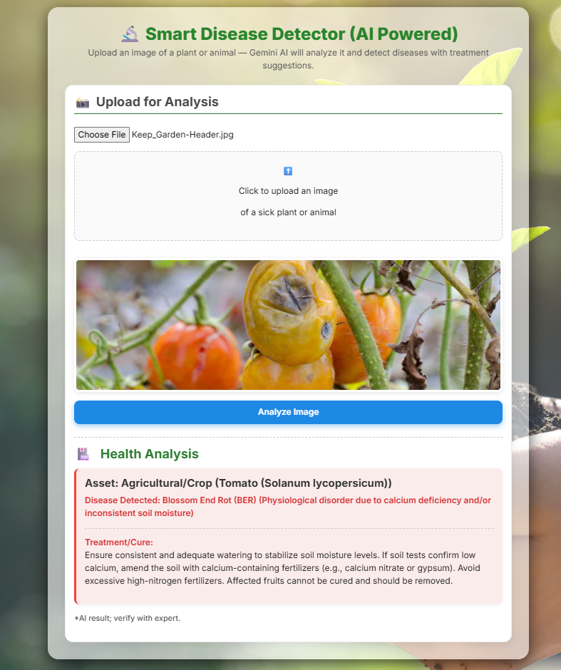
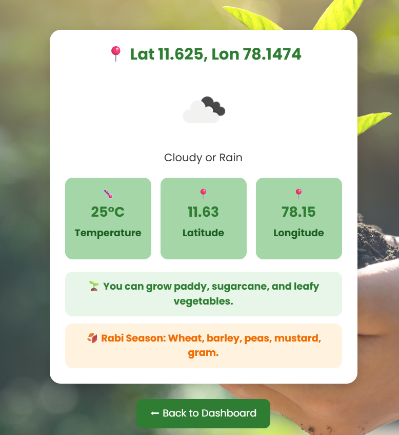

# 🌾 Agri-AI – Intelligent Smart Farming Platform

Agri-AI is a **full-stack smart agriculture platform** designed to help farmers make better decisions using **Artificial Intelligence and real-time data**.

Built using **React.js, Flask, Gemini Vision AI and MongoDB**, the system provides **crop recognition, plant disease detection, AI farmer chatbot, weather monitoring, agriculture news, market price insights and farm management tools** in one intelligent platform.

# 📸 Project Screenshots

## 🏠 Dashboard

## 🤖 AI Farmer Chatbot

## 🌱 Crop Recognition

## 🦠 Plant Disease Detection

## 🌦 Weather Monitoring

---

# 🔥 Key Features

## 🤖 AI Farmer Chatbot

* Ask farming questions in natural language
* Get expert advice on crops, fertilizers, irrigation and livestock
* AI powered conversational assistant

---

## 🌱 Crop Recognition

Upload crop images and the AI will:

* Identify crop species
* Provide farming insights
* Suggest crop management practices

Powered by **Gemini Vision AI**.

---

## 🦠 Plant Disease Detection

Detect plant diseases instantly by uploading plant images.

The system provides:

* Disease identification
* Causes of infection
* Treatment recommendations
* Prevention methods

---

## 🌦 Live Weather Monitoring

Real-time weather data helps farmers plan activities.

Includes:

* Temperature
* Humidity
* Wind speed
* Weather conditions

Powered by **Open-Meteo Weather API**.

---

## 📰 Agriculture News Feed

Stay updated with the latest farming developments.

Includes:

* Government schemes
* Agriculture innovations
* Farming policies
* Research updates

Powered by **NewsAPI**.

---

## 💹 Market Price Insights

Daily market prices for agricultural products such as:

* Dairy products
* Vegetables
* Fruits
* Seeds and fertilizers

Helps farmers decide the **best time to sell crops**.

---

## 🧾 Farm Management System

Digital farm management features:

* Farmer signup and login
* Farm profile storage
* Crop tracking
* Expense tracking
* Production monitoring

All data is securely stored using **MongoDB**.

---

# 🏗 System Architecture

Farmer
↓
React Frontend
↓
Flask Backend
↓
MongoDB Database

AI Services
• Gemini Vision AI
• AI Models

External APIs
• Weather API
• News API

---

# 🛠 Technology Stack

| Layer    | Technology                      |
| -------- | ------------------------------- |
| Frontend | React.js                        |
| Backend  | Flask (Python)                  |
| AI       | Gemini Vision AI                |
| Database | MongoDB                         |
| APIs     | Open-Meteo Weather API, NewsAPI |
| Tools    | Git, GitHub, VS Code            |

---

# ⚙ Installation & Setup

### Clone Repository

git clone https://github.com/Midhun-Saravanan/Agri-Ai.git
cd Agri-Ai

---

### Install Backend Dependencies

pip install flask flask-cors python-dotenv pymongo requests openai

---

### Setup Environment Variables

Create `.env` file inside backend folder and add:

OPENAI_API_KEY=your_openai_key
GEMINI_API_KEY=your_gemini_key
NEWS_API_KEY=your_newsapi_key

---

### Start MongoDB

mongod

---

### Run Flask Backend

python app.py

---

### Run React Frontend

cd frontend
npm install
npm start

---

# 🔗 API Endpoints

| Endpoint          | Method | Description              |
| ----------------- | ------ | ------------------------ |
| /api/signup       | POST   | Farmer registration      |
| /api/login        | POST   | Farmer login             |
| /api/upload_image | POST   | Crop / disease detection |
| /api/weather      | GET    | Weather data             |
| /api/query        | POST   | AI chatbot               |
| /api/news         | GET    | Agriculture news         |
| /api/market       | GET    | Market prices            |

---

# 🎯 Project Impact

Agri-AI helps farmers:

* Detect crop diseases early
* Improve crop productivity
* Access real-time farming insights
* Make data-driven agricultural decisions

The platform moves agriculture toward **AI-powered smart farming**.

---

# 🚀 Future Improvements

* Multi-language support (Tamil, Hindi)
* Voice assistant for farmers
* IoT sensors for soil monitoring
* AI crop yield prediction
* Farmer marketplace
* Mobile application

---

# 👨‍💻 Author

**Midhun Saravanan**
B.Tech Information Technology
AI & Full Stack Developer
